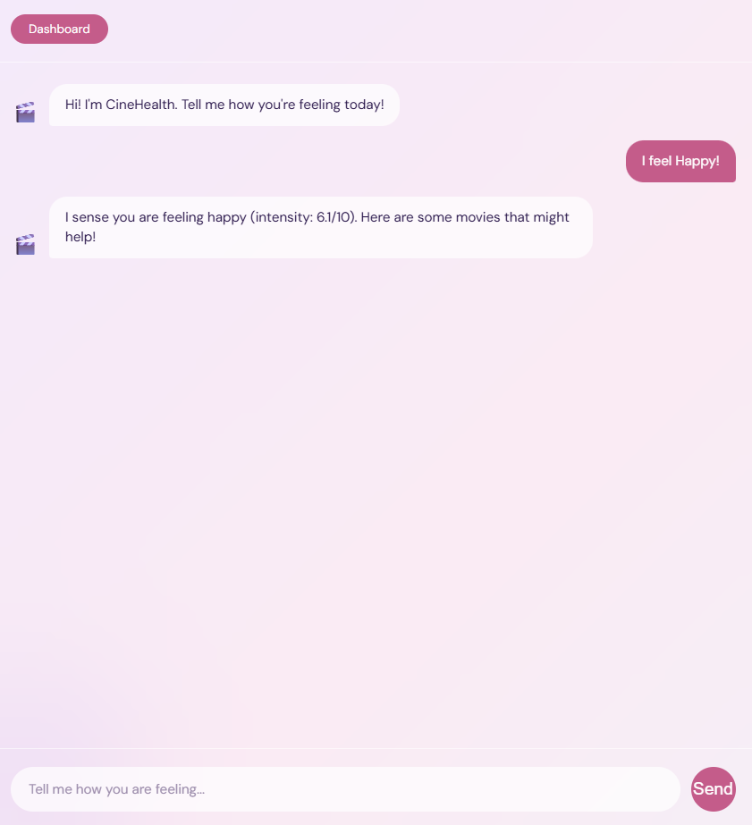
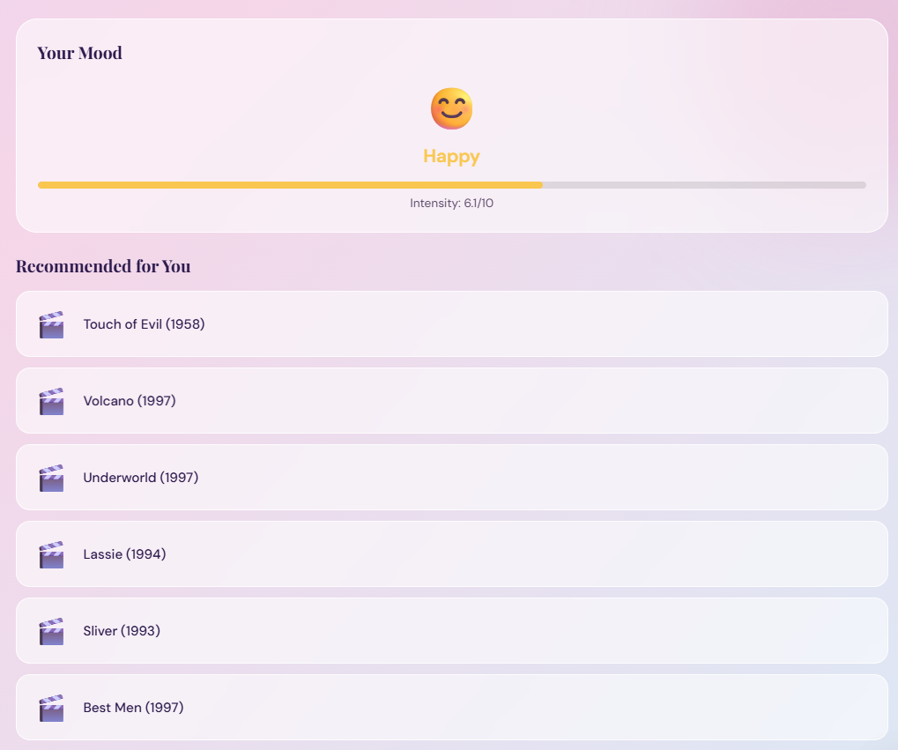
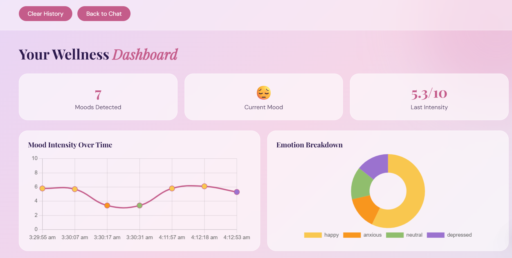

# 🎬 CineHealth

**A sentiment-aware hybrid movie recommendation system for emotional wellness.**

CineHealth detects your emotional state from natural language input and recommends movies tailored to support or shift your mood. It combines a Groq-powered chat interface, VADER sentiment analysis, collaborative filtering, and content-based filtering into a unified hybrid pipeline — served through a React frontend and FastAPI backend.

---

## Screenshots

<div align="center">

| Landing Page | Mood Chat |
|:---:|:---:|
|  |  |

| Recommendations | Wellness Dashboard |
|:---:|:---:|
|  |  |

</div>

---

## How It Works

1. **You chat with CineHealth** — a Groq-powered conversational interface asks how you're feeling today
2. **Your mood is detected** — VADER sentiment analysis maps your response to one of 6 emotional states: `happy`, `neutral`, `sad`, `anxious`, or `depressed`
3. **The hybrid engine recommends movies** — SVD collaborative filtering + TF-IDF content-based filtering, filtered by mood-appropriate genres
4. **Your Wellness Dashboard updates** — tracking your mood history and emotional patterns over sessions

---

## Features

- **Groq-Powered Chat** — Conversational UI that feels natural, not like a form
- **Mood Detection** — VADER sentiment analysis with compound scoring mapped to 6 emotional states
- **Hybrid Recommender** — SVD collaborative filtering combined with TF-IDF cosine similarity, with mood-genre filtering applied on top
- **Popularity Fallback** — Random Forest model handles cold-start users with no rating history
- **Wellness Dashboard** — Mood history, genre distribution chart, session stats
- **Movie Posters** — TMDB API fetches posters for recommended movies

---

## Tech Stack

| Layer | Tools |
|---|---|
| Frontend | React, React Router |
| Chat Interface | Groq API |
| Backend | FastAPI, Uvicorn |
| Sentiment Analysis | VADER (`vaderSentiment`) |
| Recommendation Models | SVD (scipy), TF-IDF + cosine similarity (scikit-learn), Random Forest |
| Data | MovieLens 100K |
| Notebooks | Jupyter / Google Colab |

---

## Project Structure

```
CineHealth/
├── backend/
│   ├── main.py                  # FastAPI app — 4 endpoints
│   ├── requirements.txt
│   └── models/                  # Saved model files
│       ├── cosine_sim.pkl
│       ├── tfidf_matrix.pkl
│       ├── popularity_model.pkl
│       ├── mood_genre_map.json
│       ├── movies_processed.csv
│       ├── predicted_ratings.csv
│       └── movie_features.csv
├── frontend/
│   ├── src/
│   │   ├── pages/
│   │   │   ├── Landing.js       # Landing page
│   │   │   ├── Chat.js          # Groq chat + mood detection
│   │   │   └── Dashboard.js     # Wellness dashboard
│   │   ├── App.js
│   │   └── index.js
│   └── screenshots/
├── notebooks/
│   ├── CineHealth_EDA.ipynb         # Rating distribution, genre analysis, mood-genre mapping
│   ├── CineHealth_Sentiment.ipynb   # VADER vs TextBlob comparison
│   └── CineHealth_Models.ipynb      # SVD, TF-IDF, hybrid recommender, Random Forest
└── README.md
```

---

## API Endpoints

| Method | Endpoint | Description |
|---|---|---|
| `POST` | `/analyze-mood` | Detects mood and intensity from input text via VADER |
| `POST` | `/recommend` | Returns hybrid movie recommendations filtered by mood |
| `POST` | `/predict-popularity` | Predicts popularity score for a movie using Random Forest |
| `GET` | `/eda-stats` | Returns dataset stats — total movies, users, genre distribution, top movies |

---

## Getting Started

### Prerequisites

- Python 3.8+
- Node.js 16+
- A [Groq API key](https://console.groq.com/) (free)
- A [TMDB API key](https://www.themoviedb.org/settings/api) (free)

### Backend Setup

```bash
# Clone the repo
git clone https://github.com/cryosleeperX20/CineHealth-
cd CineHealth-/backend

# Install dependencies
pip install -r requirements.txt

# Run the FastAPI server
uvicorn main:app --reload
```

API runs at `http://localhost:8000`. Docs at `http://localhost:8000/docs`.

### Frontend Setup

```bash
cd ../frontend

# Install dependencies
npm install

# Add your Groq API key
# Create a .env file in the frontend folder:
# REACT_APP_GROQ_API_KEY=your_groq_key_here
# REACT_APP_TMDB_API_KEY=your_tmdb_key_here

# Start the app
npm start
```

App runs at `http://localhost:3000`.

---

## Datasets & APIs

- **MovieLens 100K** — User-movie ratings used for collaborative filtering, EDA, and mood-genre mapping
- **TMDB API** — Used to fetch movie posters for the recommendation UI

---
